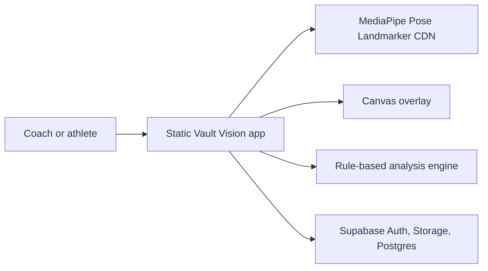

# Architecture

## Current Shape

Vault Vision V1 is a static web app. GoDaddy or any static host serves the files, while Supabase handles accounts, private video storage, session metadata, and saved analysis JSON.

## Data Flow

1. User loads a video from local device or a signed cloud URL.
2. `pose-service.js` samples frames and runs MediaPipe Pose Landmarker in the browser.
3. `analysis.js` selects the active vaulter, detects phases, scores frame/body/phase metrics, and returns an `AnalysisResult`.
4. `renderer.js` draws the active skeleton in green/yellow/red and secondary poses in muted gray.
5. `supabase-service.js` saves video files to Storage and analysis JSON to Postgres when the user is signed in.

## Key Decisions

- Static-first: fastest route to GoDaddy deployment and low infrastructure burden.
- Client-side pose estimation: keeps raw video processing off a custom server for V1.
- Rule-based scoring: transparent, testable, and workable before a labeled pole-vault dataset exists.
- Supabase: one hosted backend for auth, storage, metadata, and row-level security.

## Future Backend Triggers

Consider a non-static app when Vault Vision needs server-side processing, paid plans, team admin, coach dashboards, custom model training, background jobs, or large-video transcoding.
